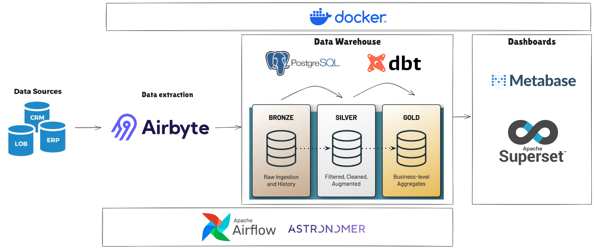

# Documentação DW

Bem-vindo à documentação de dados do DW! Este repositório contém informações detalhadas sobre a estrutura e o conteúdo de nossas bases de dados, incluindo tabelas, views, relatórios, colunas, tipos de dados, descrições e etc. A intenção é que seja um lugar onde as informações podem ser buscadas e mapeadas para criação e validação dos relatórios.

## Visão Geral

Nosso sistema de DW centraliza dados provenientes de várias fontes e os organiza de maneira a facilitar a análise e a geração de relatórios.

!!! info
    **O que é BI (Business Intelligence)**:   
    Business Intelligence (BI) é um conjunto de estratégias, processos, tecnologias e ferramentas usadas para coletar, integrar, analisar e apresentar dados empresariais de maneira que facilite a tomada de decisões informadas. O BI transforma grandes volumes de dados brutos em informações valiosas por meio de relatórios, dashboards e visualizações, permitindo que as organizações identifiquem tendências, padrões, e insights que orientam estratégias de negócios e melhoram a eficiência operacional.

## Arquitetura do Data Warehouse

A arquitetura do nosso Data Warehouse é composta pelos seguintes componentes:

- **Camada de Ingestão e Transformação**: Responsável pela extração e carga de dados das fontes para o banco de dados BI.
- **Camada de Armazenamento - Data Warehouse**: É o destino dos dados onde são carregados, transformados, tornando-os acessiveis as áreas para a gerações de novos relatórios.
- **Camada de Apresentação**: Onde se encontram os relatórios, dashboards e visualizações disponíveis aos tomadores de decisão.

## Data Warehouse

O Data Warehouse é o banco de dados onde os dados são armazenados e organizados de forma a ser utilizados pelos relatórios e dashboards.  
Nele encontraremos 2 tipos armazenagem de dados: **tabelas** e **views**

!!! info "Tabelas"
    [Explore as tabelas](tabelas/index.md)

    As tabelas é onde os dados brutos mapeados armazenados via interfaces de ingestão e transformação.

    Explore as tabelas, verifique quais campos já estão mapeados, quais são os filtros aplicados na ingestão e utilize conforme a demanda.

    Em caso de campos que não estão mapeados, abra uma solicitação para que possamos avaliar e extrair essas informações das fontes.

!!! info "Views"
    [Explore as Views](views/index.md)

    Nesta seção, você encontrará exemplos de consultas SQL e relatórios que podem ser gerados a partir dos dados armazenados no Data Warehouse.

## Contato

Para mais informações ou dúvidas, entre em contato com a equipe de desenvolvimento.

---
